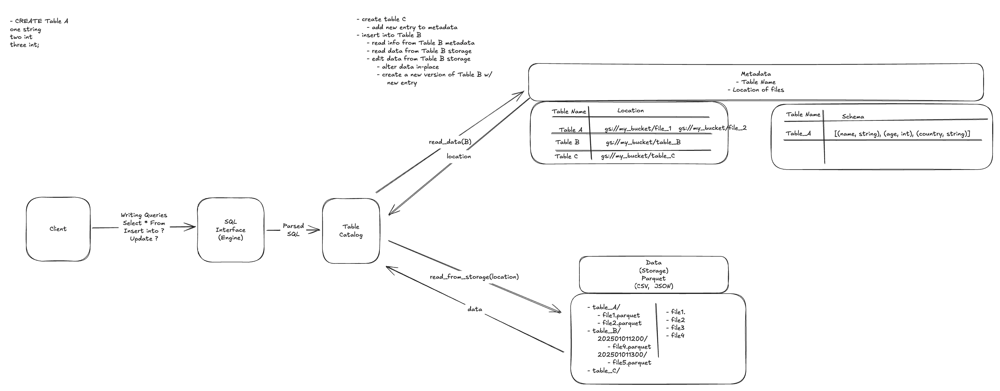

# Overview

This repository contains a small SQL engine prototype that writes and reads data in Parquet files, using a simple JSON “catalog” for metadata. 

The code is organized in two main parts:

- **src/** – Implementation of the engine, storage layer, parser, planner, and catalog.
- **otf-package/** – A minimal Python package with dependencies (no functional code beyond printing “Hello from otf-package!”).

# Key Modules

- **engine** - The engine ties together parsing, catalog management, and storage operations.
A dispatch table maps SQL operations to handler methods.
- **parser** - Uses the sqlglot library to parse SQL strings and produce a Plan dataclass
- **planner** - Defines supported SQL operations and the Plan dataclass that normalizes parsed queries
- **catalog** - Manages a JSON manifest file (src/catalog/manifest.json) storing table schemas and data file references
- **storage** - Uses Pandas to store data in Parquet format (src/storage/). It can write new files, insert additional data, and read the most recent file for a table.
